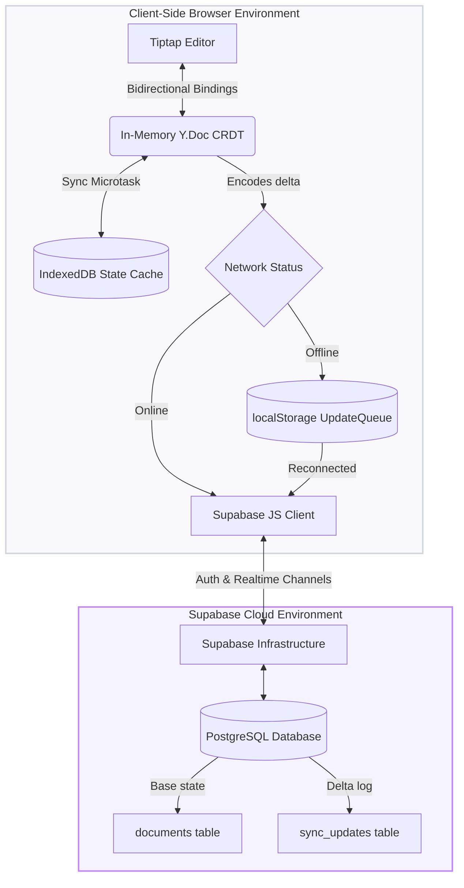

# 🚀 Colab — Local-First Collaborative Document Editor

A high-performance, **offline-first** collaborative text editor built on a modern stack: **Next.js 16**, **Supabase**, **Yjs (CRDT)**, and **Tiptap (ProseMirror)**.

Colab is designed to prioritize the user's data under any network condition. It operates with a **local-first** approach: all edits are immediately saved locally to the browser's persistent storage and synced to the cloud seamlessly when a connection is available.

---

## 🌟 Key Features

### 📡 Offline & Connectivity Resilience
* **Zero-Block Offline Editing:** Create, view, and edit documents completely offline. The editor does not block or wait for network requests.
* **Auto-Recovery listeners:** Integrates window `online`/`offline` listeners that monitor network status. When the client reconnects, it immediately triggers the offline queue flush and pulls missed server updates.
* **Intelligent Network Throttling:** Detects when the client is offline and skips futile network requests, immediately routing operations to local queues.

### 🔄 Dynamic ID Remapping for Offline Creation
* **Temporary Document Shells:** Users can create new documents while offline. The application generates a temporary `offline-[uuid]` client identifier, updates local caches, and redirects the user to the editor canvas immediately.
* **Automatic Server Registering:** When connection is restored, the application calls the server-side RPC to create a real record, copies local IndexedDB Yjs database states to the real database name, transfers local storage queue states, and seamlessly updates the browser URL without reload.

### 🤝 Conflict-Free Real-Time Collaboration
* **Commutative Convergence:** Powered by Yjs, document edits are translated into commutative and associative updates. Two or more users can write concurrently, disconnect, reconnect, and converge to the exact same document state without merge UI or data loss.
* **Real-time broadcast:** Utilizes Supabase Realtime (Postgres changes broadcast) as a communication channel for live collaboration.

### 📜 Forward-Moving Version History
* **Preserved CRDT Timeline:** Restoring past document snapshots is performed as a forward update. Instead of wiping the database table or history log, the client computes the binary delta between the live state and the target snapshot and inserts it as a new update.
* **Collaboration Safe:** Forward-restores ensure other collaborators' local databases do not diverge and require no manual reconciliation.

### 🔒 Secure Logout & Session Purging
* **IndexedDB Purging:** When a user logs out, the application purges local metadata caches and deletes all document-specific IndexedDB databases to ensure absolute privacy and security on shared machines.

---

## 🏗️ Architecture Design



---

## ⚙️ How the Offline Engine Works

Colab splits data persistence into two dedicated layers for absolute data safety:

### 1. The Local State Layer (IndexedDB)
* **What it stores:** The entire merged document state.
* **How it writes:** Powered by `y-indexeddb`, every keystroke updates the local CRDT model, which writes the binary state representation into the browser's IndexedDB database named `collab-doc-[docId]` in the same microtask.
* **Why it matters:** Even if the computer loses power or the tab is closed, the user's latest keystroke is saved locally and loads immediately upon reopening the browser.

### 2. The Transport Layer (localStorage Queue)
* **What it stores:** Outgoing incremental updates (deltas) that need to be sent to other collaborators.
* **How it writes:** If the sync provider detects that the client is offline, it queues the base64-encoded update in `localStorage` under `collab_queue_[docId]`.
* **Draining:** On network reconnection, the queue drains sequentially, pushing each delta back to Supabase's `sync_updates` table.

> [!TIP]
> **Performance Optimization:** Because incremental Yjs updates are typically tiny (<1KB), using localStorage for the queue is extremely fast and light. The large, full document states are stored in IndexedDB, which has much larger storage limits.

---

## 🛠️ Detailed Code Structure

```
collab-editor/
├── __tests__/             # Unit tests (CRDT merging & offline serialization)
│   ├── crdt.test.js       # Yjs convergence unit tests
│   └── syncQueue.test.js  # localStorage UpdateQueue tests
├── app/                   # Next.js App Router (Client Component Shells)
│   ├── (auth)/            # Login & Register views
│   ├── api/               # API route handlers (auth callback, version restore)
│   ├── dashboard/         # Dashboard with local caching & sync trigger
│   ├── editor/            # Editor canvas loader & ID remapper
│   ├── favicon_io/        # Source logo assets
│   ├── globals.css        # Tailwind directives and CSS variables
│   ├── layout.jsx         # Root layout with PWARegistration injected
│   └── page.jsx           # Redirect controller to dashboard
├── components/            # Interface components
│   ├── auth/              # LoginForm, RegisterForm, and LogoutButton cache purge
│   ├── dashboard/         # NewDocumentButton with offline temporary ID generation
│   ├── editor/            # Toolbar, presence, and version timeline drawers
│   └── PWARegistration.jsx # Dynamically registers sw.js
├── e2e/                   # Integration and End-to-End tests
│   ├── auth.setup.js      # Logs in & caches auth states for Playwright
│   ├── global-setup.js    # Seeds the database with E2E test records
│   └── offline-sync.spec.js # Simulates network dropouts and sync validations
├── hooks/                 # Reusable React hooks
│   ├── useDocument.js     # Loads metadata from cache & queues offline title changes
│   ├── usePresence.js     # Broadcasts cursor locations via Realtime channels
│   └── useSyncStatus.js   # Tracks sync status pill states
├── lib/                   # Database & synchronization providers
│   ├── supabase/          # Supabase client/server initializers
│   ├── sync/              # SupabaseSyncProvider & offlineSync utilities
│   └── versions/          # Timeline version capture utils
├── public/                # Publicly served static files
│   ├── favicon_io/        # Public logo assets served at /favicon_io/*
│   ├── manifest.json      # PWA manifest
│   └── sw.js              # Network-First page shell & Static cache-first SW
└── playwright.config.js   # Playwright configuration
```

---

## 🚦 Getting Started

### 📋 Prerequisites
* Node.js v20 or higher
* npm v10 or higher
* A Supabase project

### 1. Project Installation
Clone the repository and install the dependencies:
```bash
git clone https://github.com/your-username/colab-editor.git
cd collab-editor
npm install --legacy-peer-deps
```

### 2. Configure Your Database
Run the following SQL migration scripts in order inside your Supabase SQL Editor:
1. `supabase/migrations/001_initial_schema.sql` (Tables & indexes setup)
2. `supabase/migrations/002_rls_policies.sql` (Row-Level Security)
3. `supabase/migrations/003_functions.sql` (Collaborator invites, document creation & merges)

> [!IMPORTANT]
> **Enable Realtime:** You must enable Realtime replication on the `sync_updates` table via your Supabase Database Replication settings to allow live collaboration to broadcast.

### 3. Setup Environment Variables
Create a file named `.env.local` in the root directory:
```env
NEXT_PUBLIC_SUPABASE_URL=https://your-project.supabase.co
NEXT_PUBLIC_SUPABASE_ANON_KEY=your-anon-public-key
SUPABASE_SERVICE_ROLE_KEY=your-service-role-secret-key
NEXT_PUBLIC_APP_URL=http://localhost:3000
```

### 4. Run Locally
Start the development server:
```bash
npm run dev
```
Open [http://localhost:3000](http://localhost:3000) in your browser.

---

## 🧪 Testing Guide

Colab features comprehensive Jest unit tests and Playwright E2E suites to guarantee offline sync behaves correctly:

### Unit Tests
Tests Yjs CRDT document merge convergence and UpdateQueue base64 serialization:
```bash
npm test
```

### Integration & E2E Tests
Tests user registrations, dashboard caches, offline typing, connection dropouts, re-syncs, and multi-user cursor merges:
```bash
# 1. Install chromium binaries
npx playwright install chromium

# 2. Run E2E tests (auto-runs database setups and browser sessions)
npx playwright test
```